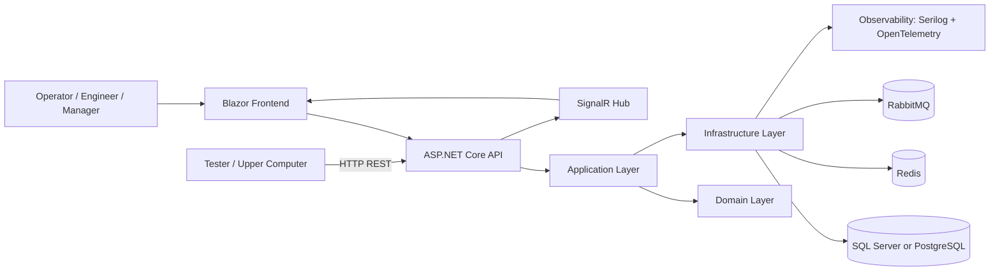
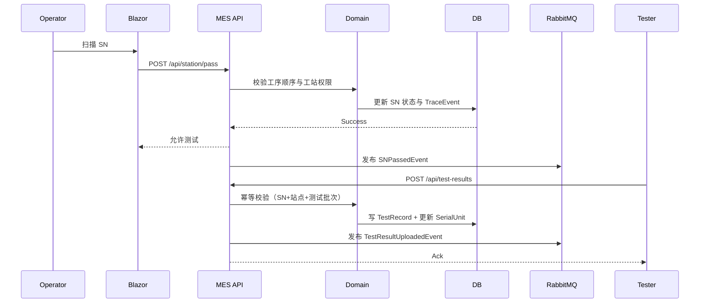

# MES 第一阶段技术方案设计（.NET 8 / C# / ASP.NET Core）

## 1. 文档目标

本方案用于指导 MES 第一阶段（3 个月）从 0 到 1 实施，遵循以下原则：

- 从最强能力切入：测试 + 上位机 + 数据
- 先小后大：先打通执行与追溯闭环，再扩展高级能力
- 先记录、再约束、后分析：先采集事实，再做流程控制和质量优化

## 2. 范围与边界

### 2.1 第一阶段目标范围（In Scope）

1. 测试流程管理（Test Flow）
2. 工站控制（Station Control）
3. 数据采集与追溯（Traceability）
4. SPC / 质量分析（基础版）
5. 报表与看板（基础版）

### 2.2 明确不做（Out of Scope）

- APS（排产）
- WMS
- ERP 深度集成（第一阶段仅预留接口，不做双向业务闭环）

### 2.3 技术约束

- 后端：.NET 8、C#、ASP.NET Core
- 架构：前后端分离
- 前端：Blazor
- 设备接入首期：HTTP/REST 上传
- 部署优先：Windows Server + IIS / Windows Service
- 数据库只选：SQL Server 或 PostgreSQL
- 第一阶段不采用：SQLite、MySQL

## 3. 总体架构

### 3.1 逻辑架构

### 3.2 分层与职责

- API Layer
  - 对外提供 REST API
  - 处理鉴权、参数校验、幂等头
  - 提供 SignalR 推送端点
- Application Layer
  - 编排业务用例（开工、过站、上传结果、追溯查询）
  - 事务边界与一致性控制
- Domain Layer
  - 核心业务规则（工序顺序、站点约束、SN 状态机）
  - 领域事件定义
- Infrastructure Layer
  - EF Core 持久化
  - Redis 缓存
  - RabbitMQ 事件发布
  - 日志、审计、监控对接
- Device Adapter（首期可并入 API 项目）
  - 接收上位机测试结果
  - 协议归一化与字段映射

## 4. 业务域设计

### 4.1 核心实体

- WorkOrder（工单）
  - 编号、产品型号、计划数量、状态、开始结束时间
- Station（工站）
  - 工站编码、线体、是否测试站、可执行工序集合
- SerialUnit（SN 实例）
  - SN、工单、当前工序、过站状态、最后测试结果
- RouteStep（流程步骤）
  - 步骤序号、步骤类型、是否可返工、前后依赖
- TestRecord（测试记录）
  - SN、站点、测试时间、结果、明细参数、原始报文
- TraceEvent（追溯事件）
  - 事件类型、人员、设备、站点、时间、上下文
- SpcRule（SPC 规则）
  - 指标名、控制上限下限、告警策略
- AlarmEvent（告警事件）
  - 级别、来源、内容、确认状态、处理人

### 4.2 关键状态机

- WorkOrder：Created -> Released -> InProgress -> Paused -> Completed -> Closed
- SerialUnit：Created -> InProcess -> TestedPass / TestedFail -> Rework / Scrapped -> Done
- AlarmEvent：New -> Acknowledged -> Resolved -> Closed

## 5. 核心流程设计

### 5.1 流程一：SN 过站 + 测试上传

### 5.2 流程二：追溯查询

- 输入 SN
- 聚合工单、工站、测试记录、异常处置、人员操作
- 输出时间线视图
- 要求 95% 查询在 2 秒内返回（首期目标）

### 5.3 流程三：SPC 基础分析

- 统计周期：按小时 / 班次
- 指标：良率、一次通过率、关键参数均值与波动
- 越界规则：超出阈值自动生成告警并推送看板

## 6. 数据库方案与决策矩阵

### 6.1 数据库选型范围

第一阶段数据库仅在以下二者中选择：

- SQL Server
- PostgreSQL

不采用：SQLite、MySQL

### 6.2 选型对比

| 维度 | SQL Server | PostgreSQL |
| --- | --- | --- |
| 工厂 IT 团队熟悉度 | 通常较高 | 视团队而定 |
| .NET 生态集成 | 非常成熟 | 成熟 |
| 许可成本 | 商业授权成本较高 | 开源成本低 |
| 运维工具 | 企业工具链完善 | 社区/企业工具充足 |
| 扩展能力 | 强 | 强 |

### 6.3 首期建议

- 若现场 IT 以微软体系为主：优先 SQL Server
- 若成本敏感且具备开源数据库运维能力：优先 PostgreSQL

## 7. 核心数据模型（首批表）

- work_orders
- stations
- route_steps
- serial_units
- station_pass_records
- test_records
- trace_events
- spc_rules
- spc_snapshots
- alarm_events
- users
- roles
- user_roles
- audit_logs

### 7.1 关键索引建议

- serial_units(sn) 唯一索引
- test_records(sn, station_code, test_batch_id) 唯一索引（幂等）
- trace_events(sn, event_time) 复合索引
- station_pass_records(work_order_no, station_code, pass_time) 复合索引

## 8. API 契约（首期）

### 8.1 工单与工站

- POST /api/work-orders
- POST /api/work-orders/{no}/release
- POST /api/work-orders/{no}/start
- GET /api/stations
- POST /api/station/pass

### 8.2 测试与追溯

- POST /api/test-results
- POST /api/test-results/batch
- GET /api/traceability/{sn}
- GET /api/traceability/{sn}/timeline

### 8.3 SPC 与看板

- GET /api/spc/summary
- GET /api/spc/rules
- POST /api/spc/rules
- GET /api/dashboard/realtime

### 8.4 幂等与错误码

- 幂等键：Idempotency-Key（Header）+ 业务唯一键
- 常见错误码：
  - MES-4001 参数非法
  - MES-4002 工序不匹配
  - MES-4003 工站未授权
  - MES-4091 重复上传
  - MES-5001 系统异常

## 9. 非功能设计

### 9.1 性能目标（MVP）

- 测试结果写入吞吐：>= 200 条/秒（单线体目标）
- 追溯查询：95% 请求 <= 2 秒
- 看板刷新：5 秒内可见最新聚合数据

### 9.2 可用性与可靠性

- API 超时重试（指数退避）
- 上传接口幂等去重
- RabbitMQ 死信队列处理失败消息
- 离线补传：按发生时间重排入库

### 9.3 安全与审计

- JWT + RBAC
- 操作审计：工单状态变更、手动放行、规则变更
- 数据脱敏：按角色屏蔽敏感字段

## 10. 部署拓扑（首期）

### 10.1 推荐部署

- Windows Server
- IIS 承载 Web API 与 Blazor 前端
- Windows Service 承载后台任务（聚合、补偿、告警）
- 独立部署 Redis 与 RabbitMQ

### 10.2 环境划分

- DEV（开发）
- SIT（集成测试）
- UAT（试生产）
- PROD（生产）

### 10.3 发布策略

- 蓝绿或滚动发布
- 数据库迁移脚本版本化
- 发布失败支持一键回滚

## 11. 三个月实施里程碑

### M1（第 1 个月）：执行闭环

交付：

- 工单管理
- 工站管理
- SN 扫码过站
- 测试结果上传

验收：

- 单条产线可稳定完成从过站到测试入库
- 重复上传不会导致重复计数

### M2（第 2 个月）：流程约束 + SPC

交付：

- 测试流程引擎（串行流程）
- 基础 SPC 统计
- 告警机制

验收：

- 不允许非法跳工序
- 可生成班次级良率与关键指标曲线

### M3（第 3 个月）：追溯 + 看板

交付：

- 全链路 SN 追溯
- 实时看板
- 基础报表

验收：

- 输入 SN 可查看完整时间线
- 管理端看板可实时反映产出与不良

## 12. 风险与应对

- 设备接入不稳定
  - 应对：统一接入契约 + 批量补传接口 + 重试策略
- 网络波动导致数据丢失
  - 应对：上位机本地缓存 + 服务端幂等
- 追溯数据增长导致查询变慢
  - 应对：冷热分层 + 索引优化 + 聚合快照
- 权限控制复杂
  - 应对：RBAC 从最小角色集起步，逐步细化

## 13. 第二阶段预留

- 设备协议扩展（OPC-UA / TCP）
- 独立 Device Gateway
- 更丰富的 SPC 规则引擎
- ERP 接口适配（主数据同步优先）

## 14. 实施检查清单

- 第一阶段范围是否冻结并形成变更流程
- 数据库是否在 SQL Server / PostgreSQL 中冻结为单一实现
- 幂等与审计是否覆盖关键写入接口
- 追溯链是否可从 SN 一键拉通
- 看板指标是否与现场管理口径一致
