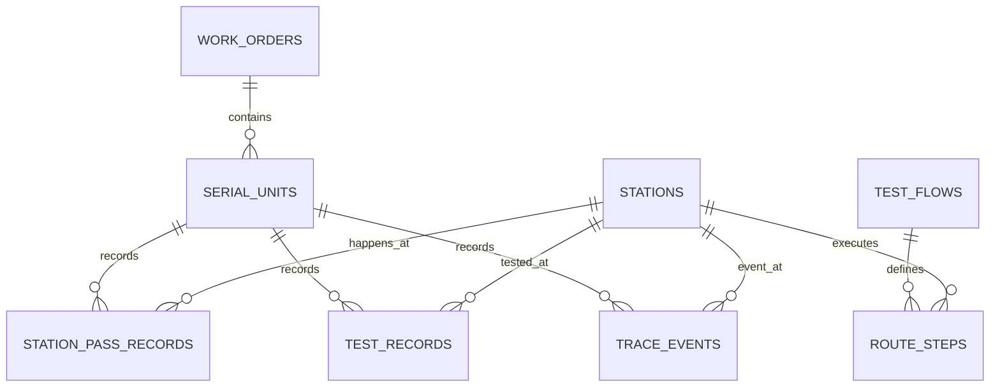

# MES Database Design

## 1. 目标与范围

本文件用于承接 MES 第一阶段数据库专项设计，目标是为当前 MVP 闭环提供一套可落地、可迁移、可演进的关系型数据库方案。

第一阶段数据库设计必须完整覆盖以下业务闭环：

- 工单创建
- 工站主数据管理
- 测试流程定义与激活
- SN 过站
- 测试结果上传
- SN 追溯查询

本设计只覆盖 M1 必需表结构与约束，不在首批版本一次性落地 SPC、告警、权限审计等后续能力。

## 2. 设计原则

- 先记录、再约束、后分析
- 主数据、执行态、事实记录分层设计
- 以幂等、追溯、一致性为优先目标
- 逻辑模型保持可移植，物理实现首期只选一个正式数据库 provider
- SQLite 仅可用于个人本地实验，不纳入第一阶段正式数据库方案

## 3. 数据库选型

### 3.1 可选范围

第一阶段正式数据库仅在以下二者中选择：

- SQL Server
- PostgreSQL

明确不采用：

- SQLite
- MySQL

### 3.2 选型结论

当前仓库建议首期正式选型为 SQL Server。

原因如下：

- 当前技术栈以 .NET 8、ASP.NET Core、EF Core 为主，SQL Server 集成成熟
- 部署目标优先 Windows Server + IIS / Windows Service，SQL Server 更贴近现场常见微软体系
- 第一阶段重点在执行闭环、幂等写入、追溯查询和事务一致性，SQL Server 能力成熟且风险较低
- 交付初期更需要稳定保守的实施路径，而不是多数据库并行维护

PostgreSQL 保留为正式备选方案，适用于以下情况：

- 团队明确具备 PostgreSQL 运维能力
- 现场更偏开源体系
- 后续希望更重度使用 JSONB、扩展索引或成本控制策略

SQLite 仅允许用于个人本地实验、概念验证或原型调试，不进入仓库正式主线，不作为默认迁移目标，不写入正式部署方案。

### 3.3 选型对比

| 维度 | SQL Server | PostgreSQL |
| --- | --- | --- |
| .NET / EF Core 集成 | 非常成熟 | 成熟 |
| Windows Server / IIS 场景 | 更常见 | 可行 |
| 许可成本 | 商业授权成本较高 | 开源成本低 |
| JSON 能力 | 可用 | 更强 |
| 现场 IT 熟悉度 | 通常较高 | 视团队而定 |
| 首期实施风险 | 较低 | 取决于团队经验 |

## 4. 数据建模策略

### 4.1 分层思路

数据库表按职责分为三类：

1. 主数据表：定义稳定业务主对象
2. 执行态快照表：保存当前状态，支撑实时控制
3. 事实记录表：保存发生过的业务事件，支撑追溯与分析

对应本项目的划分如下：

| 类别 | 表 |
| --- | --- |
| 主数据表 | `work_orders`, `stations`, `test_flows`, `route_steps` |
| 执行态快照表 | `serial_units` |
| 事实记录表 | `station_pass_records`, `test_records`, `trace_events` |

这种拆分的原因是：

- `serial_units` 用于保存 SN 当前状态，服务当前业务判断
- `station_pass_records` 与 `trace_events` 用于保存历史，不应被覆盖
- `test_records` 需要独立记录每次测试事实，同时承担幂等控制

### 4.2 主键策略

建议所有核心业务表统一采用“技术主键 + 业务唯一键”模式。

- 技术主键：`id`
- 业务唯一键：如 `work_order_no`、`station_code`、`flow_code`、`sn`

推荐原因：

- 减少后续外键扩展成本
- 降低字符串主键在关联表中的冗余与索引负担
- 便于后续做审计、迁移、归档和多工厂扩展

SQL Server 物理实现建议：

- 主键类型优先 `uniqueidentifier` 或 `bigint identity`
- 若强调分布式写入和跨系统主键稳定性，优先 `uniqueidentifier`
- 若强调顺序写入与聚集索引效率，可选择 `bigint identity`

第一阶段建议统一采用 `uniqueidentifier`，降低后续实体扩展和外部集成成本。

### 4.3 枚举存储策略

建议状态类枚举使用短字符串持久化，而不是直接存整数。

原因如下：

- 可读性更强
- 避免未来枚举顺序调整造成历史数据语义漂移
- 更方便数据库排障和报表查询

涉及字段包括：

- `work_orders.status`
- `serial_units.status`
- `route_steps.step_type`
- `station_pass_records.pass_result`

## 5. 概念模型

### 5.1 核心关系

- 一个 `work_order` 对应多个 `serial_units`
- 一个 `test_flow` 对应多个 `route_steps`
- 一个 `station` 可出现在多个 `route_steps` 中
- 一个 `serial_unit` 对应多条 `station_pass_records`
- 一个 `serial_unit` 对应多条 `test_records`
- 一个 `serial_unit` 对应多条 `trace_events`

### 5.2 ER 关系图

## 6. 第一阶段核心表设计

### 6.1 work_orders

用途：保存工单主数据，作为 SN 与流程执行的业务入口。

| 字段 | 类型建议 | 约束 | 说明 |
| --- | --- | --- | --- |
| `id` | `uniqueidentifier` | PK | 技术主键 |
| `work_order_no` | `nvarchar(64)` | UNIQUE, NOT NULL | 工单号 |
| `product_code` | `nvarchar(64)` | NOT NULL | 产品编码 |
| `planned_qty` | `int` | NOT NULL | 计划数量 |
| `status` | `nvarchar(32)` | NOT NULL | 工单状态 |
| `test_flow_code` | `nvarchar(64)` | NULL | 绑定测试流程编码快照 |
| `created_at` | `datetimeoffset` | NOT NULL | 创建时间 |

索引建议：

- `UX_work_orders_work_order_no`
- `IX_work_orders_product_code_status`

### 6.2 stations

用途：保存工站主数据和工站属性。

| 字段 | 类型建议 | 约束 | 说明 |
| --- | --- | --- | --- |
| `id` | `uniqueidentifier` | PK | 技术主键 |
| `station_code` | `nvarchar(64)` | UNIQUE, NOT NULL | 工站编码 |
| `name` | `nvarchar(128)` | NOT NULL | 工站名称 |
| `line_code` | `nvarchar(64)` | NOT NULL | 线体编码 |
| `is_test_station` | `bit` | NOT NULL | 是否测试站 |
| `created_at` | `datetimeoffset` | NOT NULL | 创建时间 |

索引建议：

- `UX_stations_station_code`
- `IX_stations_line_code`

### 6.3 test_flows

用途：保存测试流程头信息，一个产品可有多个版本，但同一时刻只允许一个启用版本。

| 字段 | 类型建议 | 约束 | 说明 |
| --- | --- | --- | --- |
| `id` | `uniqueidentifier` | PK | 技术主键 |
| `flow_code` | `nvarchar(64)` | UNIQUE, NOT NULL | 流程编码 |
| `name` | `nvarchar(128)` | NOT NULL | 流程名称 |
| `product_code` | `nvarchar(64)` | NOT NULL | 产品编码 |
| `version` | `nvarchar(32)` | NOT NULL | 版本号 |
| `is_active` | `bit` | NOT NULL | 是否启用 |
| `created_at` | `datetimeoffset` | NOT NULL | 创建时间 |

索引建议：

- `UX_test_flows_flow_code`
- `UX_test_flows_product_code_version`
- 对 `product_code` + `is_active = 1` 建过滤唯一索引，保证同产品只有一个激活流程

### 6.4 route_steps

用途：保存测试流程内的有序工序步骤。

| 字段 | 类型建议 | 约束 | 说明 |
| --- | --- | --- | --- |
| `id` | `uniqueidentifier` | PK | 技术主键 |
| `test_flow_id` | `uniqueidentifier` | FK, NOT NULL | 关联 `test_flows.id` |
| `sequence` | `int` | NOT NULL | 步骤序号 |
| `step_code` | `nvarchar(64)` | NOT NULL | 步骤编码 |
| `station_id` | `uniqueidentifier` | FK, NOT NULL | 关联 `stations.id` |
| `step_type` | `nvarchar(32)` | NOT NULL | 步骤类型 |
| `allow_rework` | `bit` | NOT NULL | 是否允许返工 |

索引建议：

- `UX_route_steps_flow_sequence` on (`test_flow_id`, `sequence`)
- `UX_route_steps_flow_step_code` on (`test_flow_id`, `step_code`)
- `IX_route_steps_station_id`

### 6.5 serial_units

用途：保存 SN 当前执行态，是执行控制的核心快照表。

| 字段 | 类型建议 | 约束 | 说明 |
| --- | --- | --- | --- |
| `id` | `uniqueidentifier` | PK | 技术主键 |
| `sn` | `nvarchar(128)` | UNIQUE, NOT NULL | SN 码 |
| `work_order_id` | `uniqueidentifier` | FK, NOT NULL | 关联 `work_orders.id` |
| `current_station_id` | `uniqueidentifier` | FK, NULL | 当前工站 |
| `status` | `nvarchar(32)` | NOT NULL | SN 状态 |
| `last_test_passed` | `bit` | NULL | 最近测试结果 |
| `completed_step_sequence` | `int` | NULL | 已完成步骤序号 |
| `pending_step_sequence` | `int` | NULL | 待执行步骤序号 |
| `updated_at` | `datetimeoffset` | NOT NULL | 更新时间 |
| `row_version` | `rowversion` | NOT NULL | 乐观并发控制 |

索引建议：

- `UX_serial_units_sn`
- `IX_serial_units_work_order_id_status`
- `IX_serial_units_current_station_id_status`

### 6.6 station_pass_records

用途：保存每一次过站事实，避免只在 `serial_units` 中覆盖当前工站导致历史丢失。

| 字段 | 类型建议 | 约束 | 说明 |
| --- | --- | --- | --- |
| `id` | `uniqueidentifier` | PK | 技术主键 |
| `serial_unit_id` | `uniqueidentifier` | FK, NOT NULL | 关联 `serial_units.id` |
| `work_order_id` | `uniqueidentifier` | FK, NOT NULL | 关联 `work_orders.id` |
| `station_id` | `uniqueidentifier` | FK, NOT NULL | 关联 `stations.id` |
| `sn_snapshot` | `nvarchar(128)` | NOT NULL | SN 快照 |
| `station_code_snapshot` | `nvarchar(64)` | NOT NULL | 工站编码快照 |
| `flow_code_snapshot` | `nvarchar(64)` | NULL | 流程编码快照 |
| `route_step_sequence` | `int` | NULL | 对应步骤序号 |
| `operator_id` | `nvarchar(64)` | NULL | 操作员 |
| `pass_result` | `nvarchar(32)` | NOT NULL | 过站结果 |
| `remarks` | `nvarchar(256)` | NULL | 备注 |
| `passed_at` | `datetimeoffset` | NOT NULL | 过站时间 |

索引建议：

- `IX_station_pass_records_serial_unit_id_passed_at`
- `IX_station_pass_records_work_order_id_station_id_passed_at`
- `IX_station_pass_records_sn_snapshot_passed_at`

### 6.7 test_records

用途：保存测试结果事实，并承担幂等唯一约束。

| 字段 | 类型建议 | 约束 | 说明 |
| --- | --- | --- | --- |
| `id` | `uniqueidentifier` | PK | 技术主键 |
| `serial_unit_id` | `uniqueidentifier` | FK, NOT NULL | 关联 `serial_units.id` |
| `station_id` | `uniqueidentifier` | FK, NOT NULL | 关联 `stations.id` |
| `sn_snapshot` | `nvarchar(128)` | NOT NULL | SN 快照 |
| `station_code_snapshot` | `nvarchar(64)` | NOT NULL | 工站编码快照 |
| `test_batch_id` | `nvarchar(64)` | NOT NULL | 测试批次号 |
| `passed` | `bit` | NOT NULL | 测试结果 |
| `metrics_json` | `nvarchar(max)` | NOT NULL | 测试指标 JSON |
| `raw_payload` | `nvarchar(max)` | NULL | 原始报文 |
| `tested_at` | `datetimeoffset` | NOT NULL | 测试时间 |

唯一约束与索引建议：

- `UX_test_records_sn_station_batch` on (`sn_snapshot`, `station_code_snapshot`, `test_batch_id`)
- `IX_test_records_serial_unit_id_tested_at`
- `IX_test_records_station_id_tested_at`

说明：

- 该唯一约束直接支撑当前业务中的幂等规则 `MES-4091`
- `metrics_json` 首期建议 JSON 存储，待 SPC 指标冻结后再决定是否拆表

### 6.8 trace_events

用途：保存追溯事件时间线，保持 append-only。

| 字段 | 类型建议 | 约束 | 说明 |
| --- | --- | --- | --- |
| `id` | `uniqueidentifier` | PK | 技术主键 |
| `serial_unit_id` | `uniqueidentifier` | FK, NOT NULL | 关联 `serial_units.id` |
| `station_id` | `uniqueidentifier` | FK, NULL | 关联 `stations.id` |
| `sn_snapshot` | `nvarchar(128)` | NOT NULL | SN 快照 |
| `event_type` | `nvarchar(64)` | NOT NULL | 事件类型 |
| `station_code_snapshot` | `nvarchar(64)` | NULL | 工站编码快照 |
| `operator_id` | `nvarchar(64)` | NULL | 操作人 |
| `message` | `nvarchar(256)` | NULL | 事件说明 |
| `context_json` | `nvarchar(max)` | NULL | 上下文 JSON |
| `occurred_at` | `datetimeoffset` | NOT NULL | 事件发生时间 |

索引建议：

- `IX_trace_events_sn_occurred_at` on (`sn_snapshot`, `occurred_at`)
- `IX_trace_events_serial_unit_id_occurred_at`
- `IX_trace_events_event_type_occurred_at`

## 7. 关键约束与一致性策略

### 7.1 幂等约束

首期最重要的幂等场景是测试结果上传。

约束策略：

- 业务键：`sn + station_code + test_batch_id`
- 物理实现：`test_records` 唯一约束
- 应用层仍保留显式存在性检查，数据库负责最终兜底

后续如增加 `Idempotency-Key` Header，可新增单独幂等表或把 Header 作为辅助字段进入写入表。

### 7.2 并发控制

`serial_units` 需要承担高频状态更新，因此必须加入乐观并发控制。

建议：

- SQL Server 使用 `rowversion`
- 应用层更新时基于并发令牌提交
- 冲突时返回明确业务错误，避免 SN 状态被并发覆盖

### 7.3 删除策略

首期建议以逻辑上“禁止级联删除”为主：

- `work_orders` 不应级联删除 `serial_units`
- `serial_units` 不应级联删除 `test_records`、`trace_events`、`station_pass_records`
- `stations` 与 `test_flows` 若被引用，应禁止直接删除

原因：MES 首要目标之一是追溯，历史事实记录不应因主数据误删而丢失。

## 8. 查询与索引设计

### 8.1 当前核心查询

第一阶段主要查询模式如下：

- 按工单号查询工单
- 按工站编码查询工站
- 按流程编码查询流程
- 按产品编码查询当前激活流程
- 按 SN 查询当前执行态
- 按 SN 拉取测试记录与追溯时间线

### 8.2 首批关键索引

- `work_orders(work_order_no)` 唯一索引
- `stations(station_code)` 唯一索引
- `test_flows(flow_code)` 唯一索引
- `test_flows(product_code, version)` 唯一索引
- `serial_units(sn)` 唯一索引
- `test_records(sn_snapshot, station_code_snapshot, test_batch_id)` 唯一索引
- `trace_events(sn_snapshot, occurred_at)` 复合索引
- `station_pass_records(serial_unit_id, passed_at)` 复合索引

## 9. 与当前代码模型的映射

当前代码中的核心实体与数据库表映射建议如下：

| Domain 实体 | 目标表 |
| --- | --- |
| `WorkOrder` | `work_orders` |
| `Station` | `stations` |
| `TestFlow` | `test_flows` |
| `RouteStep` | `route_steps` |
| `SerialUnit` | `serial_units` |
| `TestRecord` | `test_records` |
| `TraceEvent` | `trace_events` |

当前 Domain 模型尚未显式体现、但数据库必须补齐的能力包括：

- 技术主键 `id`
- 外键关系
- 乐观并发列 `row_version`
- 独立 `station_pass_records` 历史表
- JSON 列映射策略

## 10. EF Core 落地建议

首期正式实现建议放在 `MES.Infrastructure`：

- 新增 `MesDbContext`
- 为每个实体增加 `IEntityTypeConfiguration<T>` 配置类
- 以仓储模式实现现有 `Repositories.cs` 接口
- 保留当前 `InMemory` 仓储作为演示和测试替身

推荐技术栈：

- `Microsoft.EntityFrameworkCore.SqlServer`
- `Microsoft.EntityFrameworkCore.Design`
- 使用迁移管理数据库结构演进

实施顺序建议：

1. 先落 M1 核心表与索引
2. 再接入仓储 SQL 实现
3. 最后替换运行配置，实现 InMemory / SQL 双模式切换

## 11. 第二阶段预留

以下能力建议预留，但不进入第一批数据库实现：

- `spc_rules`
- `spc_snapshots`
- `alarm_events`
- `users`
- `roles`
- `user_roles`
- `audit_logs`

原因：

- 当前项目仍处于 M1 执行闭环阶段
- 提前做全会扩大实现面，延缓主链路落地
- 上述表结构依赖更清晰的组织权限、质量规则和报表口径

## 12. 结论

当前 MES 第一阶段数据库设计建议如下：

- 正式数据库首选 SQL Server
- PostgreSQL 作为单一备选，不建议双 provider 并行维护
- SQLite 仅用于个人本地实验，不进入正式方案
- 第一批数据库只覆盖 M1 核心闭环
- 采用“技术主键 + 业务唯一键 + 事实表留痕 + 快照表控态”的建模方式

该设计能够直接支撑当前项目中的 `WorkOrder`、`Station`、`TestFlow`、`RouteStep`、`SerialUnit`、`TestRecord`、`TraceEvent` 等核心对象，并为后续 EF Core 持久化实现提供稳定边界。